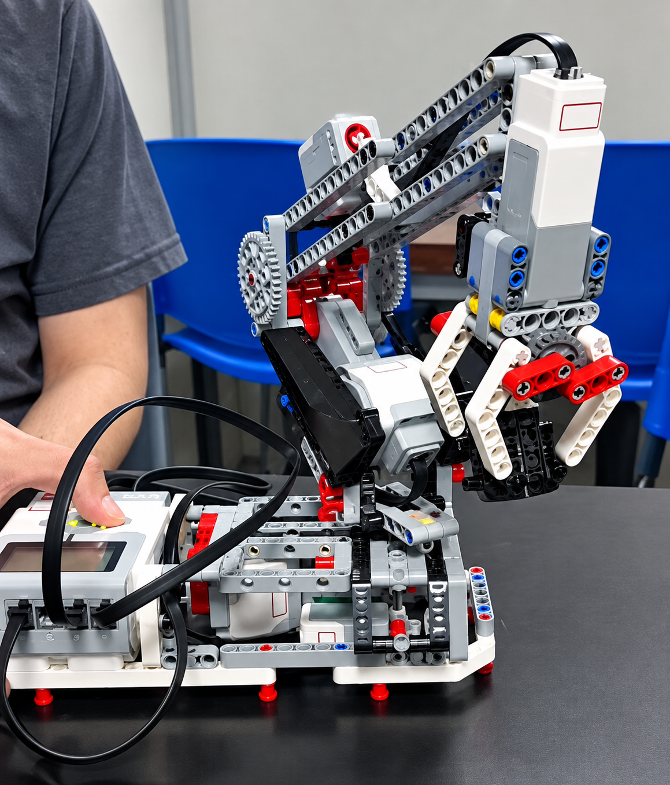
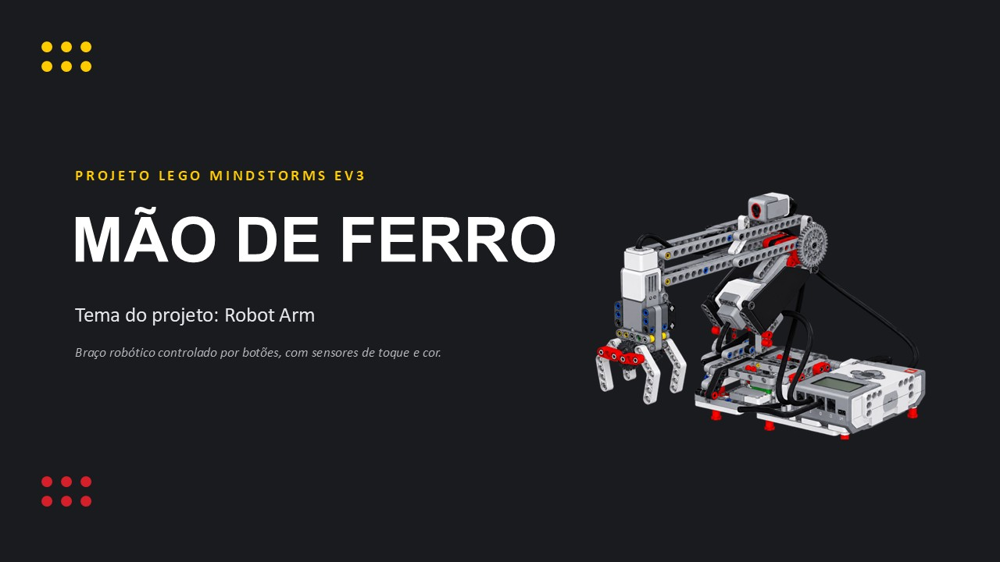

# 🦾 Braço Robótico EV3

Projeto de um braço robótico construído com **LEGO Mindstorms EV3**, programado em **Python (Pybricks)**, com controle manual via botões do hub, garra, elevação e rotação de base.

<p align="center">
  
</p>

---

## 👥 Integrantes e RA

| Nome | RA |
|---|---|
| Brunno Machado dos Santos | 2401443 |
| Guilherme Freitas Noda Silva | 2401030 |
| Natan Maurício da Silva | 2401712 |
| Victor Henrique Lopes Piovesan | 2401475 |

---

## 📷 Foto do Grupo com o Projeto

<p align="center">
  
</p>

---

## 🎥 Vídeo de Funcionamento

[](https://www.youtube.com/watch?v=wm_Ol1k0OQg)

🎬 Arquivo local: [`assets/video_funcionamento.mp4`](assets/video_funcionamento.mp4)

---

## 📊 Apresentação (PPT)

[](assets/apresentacao.pptx)

---

## 📝 Descrição do Projeto

O projeto consiste em um **braço robótico com 3 graus de liberdade** (garra, elevação e rotação de base), controlado em tempo real pelos botões do **EV3 Brick**. Ao ligar, o programa executa uma **calibração automática** da rotação da base e da elevação do braço, com limites de busca e tempo máximo (*timeout*) para evitar que o robô fique preso caso um sensor falhe em ser acionado.

---

## ⚙️ Componentes Utilizados

| Componente | Porta | Função |
|---|---|---|
| Motor Médio | A | Abertura/fechamento da garra |
| Motor Grande | B | Elevação do braço |
| Motor Grande | D | Rotação da base |
| Sensor de Toque | S2 | Referência (zero) da rotação da base |
| Sensor de Cor | S3 | Referência (zero) da elevação do braço |

---

## 🧠 Funcionamento

### Calibração automática (`calibrar`)
Executada uma única vez, logo no início do programa (antes do loop principal):

1. **Rotação da base** — gira em direção ao sensor de toque; se não o encontrar dentro do limite de busca (`LIMITE_BUSCA_ROTACAO`) ou do tempo máximo (`CALIBRACAO_TIMEOUT_MS`), inverte o sentido e tenta do outro lado; se ainda assim não conseguir, retorna à posição inicial (ângulo 0) e segue em frente. Ao final, zera o ângulo do motor nessa posição.
2. **Elevação do braço** — desce até o sensor de cor detectar a posição de referência (reflexão abaixo do limiar `LIMIAR_REFLEXAO_ELEVACAO`), respeitando também o limite de ângulo e o tempo máximo; se o tempo/limite se esgotar antes de detectar a referência, retorna à posição inicial. Ao final, zera o ângulo do motor.

### Controle manual

| Botão | Ação |
|---|---|
| ⬆️ Cima | Eleva o braço (até o limite superior) |
| ⬇️ Baixo | Abaixa o braço (até o limite inferior) |
| ⬅️ Esquerda | Gira a base para a esquerda |
| ➡️ Direita | Gira a base para a direita |
| ⏺️ Centro | Abre/fecha a garra (alternância) |

O display do EV3 exibe ícones indicando a direção do movimento atual, e um círculo preenchido/vazio representa o estado da garra (fechada/aberta).

### Limites de segurança
- Elevação limitada entre `-120°` (máximo para cima) e `200°` (máximo para baixo).
- A garra fecha até um limite de torque configurável, evitando esforço excessivo no motor.

---

## 🛠️ Parâmetros Configuráveis

```python
VELOCIDADE = 300                  # Velocidade padrão dos motores
VELOCIDADE_CALIBRACAO = 200       # Velocidade durante a calibração
LIMITE_TORQUE_GARRA = 50          # Limite de torque para fechar a garra
LIMIAR_REFLEXAO_ELEVACAO = 10     # Limiar de reflexão do sensor de cor
ELEVACAO_MAX_CIMA = 120           # Ângulo máximo para cima
ELEVACAO_MAX_BAIXO = 200          # Ângulo máximo para baixo
ANGULO_ABERTURA = 90              # Ângulo de abertura da garra
LIMITE_BUSCA_ROTACAO = 90         # Ângulo máximo de busca do sensor de toque na calibração
CALIBRACAO_TIMEOUT_MS = 5000      # Tempo máximo (ms) para cada etapa da calibração
```

---

## ▶️ Como Executar

1. Instale o firmware **Pybricks** no EV3 Brick.
2. Conecte os motores e sensores nas portas indicadas na tabela de componentes.
3. Transfira o arquivo `main.py` para o hub (via [Pybricks Code](https://code.pybricks.com/) ou VS Code com a extensão Pybricks).
4. Execute o programa — a calibração automática da base e da elevação será realizada antes do controle manual ficar disponível.
5. Utilize os botões do EV3 para controlar o braço robótico.

